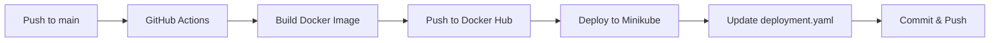

# Sample NestJS API

A production-ready NestJS REST API with automated CI/CD pipeline, Docker containerization, and Kubernetes deployment on Minikube.

## 📋 Table of Contents

- [Overview](#overview)
- [Tech Stack](#tech-stack)
- [Project Structure](#project-structure)
- [Getting Started](#getting-started)
- [Docker Containerization](#docker-containerization)
- [Kubernetes Deployment](#kubernetes-deployment)
- [CI/CD Pipeline](#cicd-pipeline)
- [Configuration](#configuration)

---

## 🎯 Overview

This project demonstrates a complete DevOps workflow for a NestJS application, including:

- **RESTful API** built with NestJS framework
- **Multi-stage Docker builds** for optimized images
- **Kubernetes orchestration** with deployment, service, and ingress resources
- **Automated CI/CD** using GitHub Actions
- **Container registry integration** with Docker Hub
- **Rolling updates** to Minikube cluster
- **Self-hosted Windows runner** for build and deployment

---

## 🛠 Tech Stack

| Category | Technology |
|----------|-----------|
| **Framework** | NestJS 11.x |
| **Runtime** | Node.js 18 (Alpine) |
| **Language** | TypeScript 5.x |
| **Containerization** | Docker (Multi-stage build) |
| **Orchestration** | Kubernetes (Minikube) |
| **CI/CD** | GitHub Actions |
| **Container Registry** | Docker Hub |
| **Ingress Controller** | NGINX Ingress |

---

## 📁 Project Structure

```
sample-api/
├── .github/
│   └── workflows/
│       └── docker-build.yml       # CI/CD pipeline definition
├── k8s/
│   ├── deployment.yaml            # Kubernetes deployment manifest
│   ├── service.yaml               # Kubernetes service (NodePort)
│   └── ingress.yaml               # Ingress resource for routing
├── src/
│   ├── app.controller.ts          # Main controller
│   ├── app.service.ts             # Business logic
│   └── main.ts                    # Application entry point
├── test/
│   └── ...                        # E2E tests
├── Dockerfile                     # Multi-stage Docker build
├── package.json                   # Dependencies and scripts
└── README.md                      # This file
```

---

## 🚀 Getting Started

### Prerequisites

- Node.js 18 or higher
- npm or yarn
- Docker Desktop (for local containerization)
- Minikube (for local Kubernetes)
- kubectl CLI tool

### Local Development

1. **Install dependencies:**
   ```bash
   npm install
   ```

2. **Run in development mode:**
   ```bash
   npm run start:dev
   ```

3. **Build the application:**
   ```bash
   npm run build
   ```

4. **Run tests:**
   ```bash
   # Unit tests
   npm run test
   
   # E2E tests
   npm run test:e2e
   
   # Test coverage
   npm run test:cov
   ```

5. **Access the API:**
   - Local: `http://localhost:3000`

---

## 🐳 Docker Containerization

The project uses a **multi-stage Docker build** to optimize image size and security.

### Dockerfile Overview

```dockerfile
# Stage 1 - Build
FROM node:18-alpine as builder
WORKDIR /app
COPY package*.json ./
RUN npm install
COPY . .
RUN npm run build

# Stage 2 - Production
FROM node:18-alpine
WORKDIR /app
COPY --from=builder /app/dist ./dist
COPY package*.json ./
RUN npm install --only=production
EXPOSE 3000
CMD ["node", "dist/main.js"]
```

**Benefits:**
- ✅ Smaller final image (only production dependencies)
- ✅ Faster builds with layer caching
- ✅ Improved security (no dev dependencies in production)

### Build and Run Locally

```bash
# Build Docker image
docker build -t sample-nestjs:local .

# Run container
docker run -p 3000:3000 sample-nestjs:local
```

---

## ☸️ Kubernetes Deployment

### Kubernetes Resources

#### 1. **Deployment** (`k8s/deployment.yaml`)
- Manages 1 replica of the NestJS app
- Uses Docker image from Docker Hub
- Exposes port 3000

#### 2. **Service** (`k8s/service.yaml`)
- Type: NodePort
- Internal port: 3000
- NodePort: 30080 (accessible externally)

#### 3. **Ingress** (`k8s/ingress.yaml`)
- Host: `sample.local`
- Ingress class: nginx
- Routes traffic to the service

### Deploy to Minikube

1. **Start Minikube:**
   ```bash
   minikube start
   ```

2. **Enable NGINX Ingress:**
   ```bash
   minikube addons enable ingress
   ```

3. **Apply Kubernetes manifests:**
   ```bash
   kubectl apply -f k8s/deployment.yaml
   kubectl apply -f k8s/service.yaml
   kubectl apply -f k8s/ingress.yaml
   ```

4. **Verify deployment:**
   ```bash
   kubectl get pods
   kubectl get svc
   kubectl get ingress
   ```

5. **Access the application:**
   ```bash
   # Via NodePort
   minikube service sample-nestjs-service --url
   
   # Via Ingress (add to /etc/hosts or C:\Windows\System32\drivers\etc\hosts)
   # <minikube-ip> sample.local
   ```

---

## 🔄 CI/CD Pipeline

The automated CI/CD pipeline is defined in `.github/workflows/docker-build.yml` and runs on every push to the `main` branch.

### Pipeline Architecture



---

## 📝 Step-by-Step CI/CD Workflow

### **Step 1: Trigger**
```yaml
on:
  push:
    branches: [ "main" ]
```
- Pipeline triggers automatically when code is pushed to the `main` branch

---

### **Step 2: Checkout Code**
```yaml
- name: Checkout code
  uses: actions/checkout@v3
```
- Clones the repository to the runner
- Ensures the latest code is available for build

---

### **Step 3: Docker Hub Authentication**
```yaml
- name: Login to Docker Hub
  uses: docker/login-action@v3
  with:
    username: ${{ secrets.DOCKER_USERNAME }}
    password: ${{ secrets.DOCKER_PASSWORD }}
```
- Authenticates to Docker Hub using GitHub Secrets
- Required to push Docker images to the registry

**Required Secrets:**
- `DOCKER_USERNAME`: Your Docker Hub username
- `DOCKER_PASSWORD`: Your Docker Hub access token

---

### **Step 4: Extract Git Commit SHA**
```yaml
- name: Extract short Git commit SHA
  id: sha
  shell: powershell
  run: |
    $short = $env:GITHUB_SHA.Substring(0,8)
    "SHORT_SHA=$short" | Out-File -FilePath $env:GITHUB_ENV -Append
```
- Extracts the first 8 characters of the Git commit SHA
- Stores it as `SHORT_SHA` environment variable
- Used for creating unique image tags (e.g., `9314b46b`)

**Why?** Each deployment gets a unique tag for versioning and rollback capability.

---

### **Step 5: Build Docker Images**
```yaml
- name: Build Docker images
  shell: powershell
  run: |
    $dockerUser = "${{ secrets.DOCKER_USERNAME }}"
    $imageName = "${{ secrets.IMAGE_NAME }}"
    
    $tag = "${dockerUser}/${imageName}:${env:SHORT_SHA}"
    $latest = "${dockerUser}/${imageName}:latest"
    
    docker build -t $tag .
    docker build -t $latest .
```
- Builds **TWO** Docker images:
  1. **Tagged with commit SHA** (e.g., `vigneshk1045/sample-nestjs:9314b46b`)
  2. **Tagged as `latest`** (e.g., `vigneshk1045/sample-nestjs:latest`)

**Benefits:**
- SHA tag: Specific version for deployments
- Latest tag: Always points to most recent build

---

### **Step 6: Push Docker Images**
```yaml
- name: Push Docker images
  shell: powershell
  run: |
    $dockerUser = "${{ secrets.DOCKER_USERNAME }}"
    $imageName = "${{ secrets.IMAGE_NAME }}"
    
    $tag = "${dockerUser}/${imageName}:${env:SHORT_SHA}"
    $latest = "${dockerUser}/${imageName}:latest"
    
    docker push $tag
    docker push $latest
```
- Pushes both images to Docker Hub
- Makes images available for Kubernetes deployment

---

### **Step 7: Deploy to Minikube**
```yaml
- name: Auto Deploy to Minikube
  shell: powershell
  run: |
    $dockerUser = "${{ secrets.DOCKER_USERNAME }}"
    $imageName = "${{ secrets.IMAGE_NAME }}"
    
    kubectl set image deployment/sample-nestjs sample-nestjs="${dockerUser}/${imageName}:${env:SHORT_SHA}" --namespace=default
    kubectl rollout status deployment/sample-nestjs --namespace=default
```
- Updates the Kubernetes deployment with the new image
- Uses `kubectl set image` to perform a **rolling update**
- Waits for rollout to complete successfully

**How it works:**
1. Kubernetes pulls the new image from Docker Hub
2. Creates new pods with updated image
3. Gradually replaces old pods (zero downtime)
4. Monitors health checks before switching traffic

---

### **Step 8: Update deployment.yaml**
```yaml
- name: Update deployment.yaml in repo
  shell: powershell
  run: |
    (Get-Content k8s/deployment.yaml) `
      -replace "image:.*", "image: ${{ secrets.DOCKER_USERNAME }}/${{ secrets.IMAGE_NAME }}:${env:SHORT_SHA}" `
      | Set-Content k8s/deployment.yaml
```
- Updates the `deployment.yaml` file with the new image tag
- Keeps the manifest in sync with actual deployment
- Uses PowerShell's `Get-Content` and regex replacement

---

### **Step 9: Commit and Push Changes**
```yaml
- name: Commit updated deployment file
  shell: powershell
  run: |
    git config --global user.email "runner@example.com"
    git config --global user.name "GitHub Runner"
    
    git add k8s/deployment.yaml
    
    git commit -m "Auto-update image tag to ${env:SHORT_SHA}"
    if ($LASTEXITCODE -ne 0) { Write-Output "No changes to commit"; exit 0 }
    
    git pull --rebase origin main
    git push origin main
```
- Configures Git with runner identity
- Commits the updated `deployment.yaml`
- Pulls latest changes with rebase (handles concurrent updates)
- Pushes changes back to the repository

**Note:** Requires `contents: write` permission in workflow.

---

## 🔐 Configuration

### GitHub Secrets Required

Add these secrets in **Settings > Secrets and variables > Actions**:

| Secret Name | Description | Example |
|-------------|-------------|---------|
| `DOCKER_USERNAME` | Docker Hub username | `vigneshk1045` |
| `DOCKER_PASSWORD` | Docker Hub access token | `dckr_pat_xxx...` |
| `IMAGE_NAME` | Docker image name | `sample-nestjs` |

### Self-Hosted Runner Setup

This pipeline runs on a **self-hosted Windows runner**:

1. Navigate to **Settings > Actions > Runners**
2. Click **New self-hosted runner**
3. Follow platform-specific instructions
4. Configure runner to start on boot
5. Ensure Docker Desktop and kubectl are installed
6. Configure kubectl to connect to your Minikube cluster

---

## 🎯 Key Features

✅ **Automated Builds** - Every push triggers a Docker build  
✅ **Version Control** - Git SHA-based image tagging  
✅ **Zero Downtime** - Rolling updates in Kubernetes  
✅ **Self-Healing** - Kubernetes restarts failed containers  
✅ **Scalability** - Easy to scale replicas up/down  
✅ **GitOps** - Deployment manifest tracked in Git  

---

## 📊 Monitoring Deployment

```bash
# Watch pod status
kubectl get pods -w

# View deployment details
kubectl describe deployment sample-nestjs

# Check rollout history
kubectl rollout history deployment/sample-nestjs

# Rollback to previous version
kubectl rollout undo deployment/sample-nestjs

# View logs
kubectl logs -f deployment/sample-nestjs
```

---

## 🤝 Contributing

1. Fork the repository
2. Create a feature branch (`git checkout -b feature/amazing-feature`)
3. Commit your changes (`git commit -m 'Add amazing feature'`)
4. Push to the branch (`git push origin feature/amazing-feature`)
5. Open a Pull Request

---

## 📝 License

This project is licensed under the UNLICENSED License.

---

## 📧 Contact

For questions or support, please open an issue in the GitHub repository.
